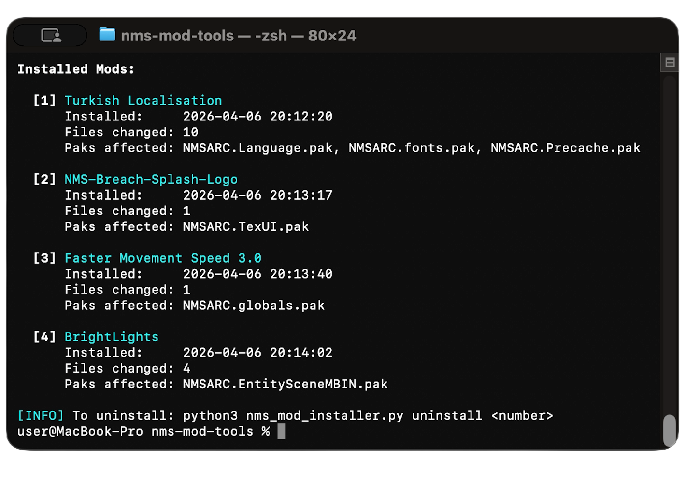
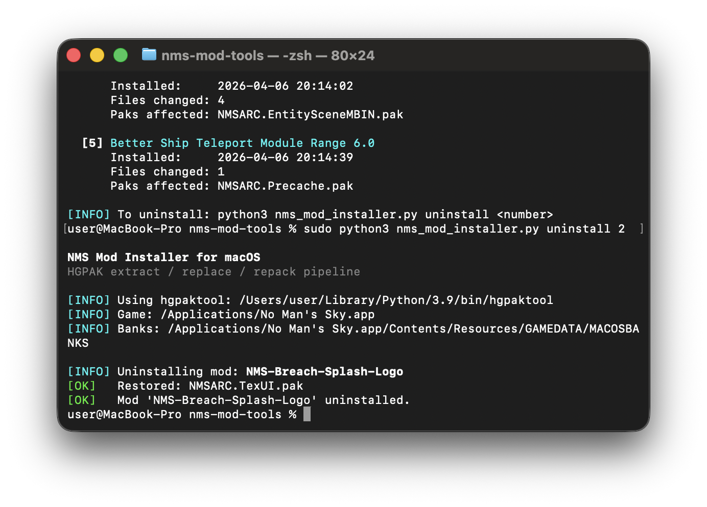

# NMS Mod Installer for macOS

A command-line tool for installing mods into **No Man's Sky** on macOS by patching HGPAK `.pak` archives.

On macOS, the game's built-in `MODS` folder does not work. This tool bridges that gap by extracting `.pak` archives, replacing files with mod contents, and repacking them with LZ4 compression — all automatically.

## How It Works

```
┌──────────────┐     ┌──────────┐     ┌──────────┐     ┌──────────┐     ┌──────────┐
│  Mod Folder  │────>│  Scan &  │────>│  Extract  │────>│ Replace  │────>│  Repack  │
│              │     │  Match   │     │   .pak    │     │  Files   │     │  & Install│
└──────────────┘     └──────────┘     └──────────┘     └──────────┘     └──────────┘
                          │                                                   │
                     Maps mod files                                    LZ4 compressed
                     to game .paks                                     HGPAK v2 format
                                                                            │
                                                                            ▼
                                                                    ┌──────────────┐
                                                                    │  MACOSBANKS/ │
                                                                    │  (game dir)  │
                                                                    └──────────────┘
```

1. **Scan** — Indexes all `.pak` archives in the game and maps each mod file to its target `.pak`
2. **Backup** — Copies original `.pak` files to `_MOD_BACKUPS/` before any changes
3. **Extract** — Unpacks affected `.pak` archives using `hgpaktool -U -M`
4. **Replace** — Overwrites extracted files with mod versions (case-insensitive matching)
5. **Repack** — Rebuilds `.pak` archives with LZ4 compression using `hgpaktool -R -Z`
6. **Register** — Records installed mod metadata for clean uninstall later

## Requirements

- **macOS** (tested on macOS 15+)
- **Python 3.9+** (pre-installed on macOS)
- **[hgpaktool](https://github.com/monkeyman192/HGPAKtool)** — HGPAK archive tool by monkeyman192
- **.NET 8 Runtime** (`Microsoft.NETCore.App 8.x`) — required for EXML-based mods (MBINCompiler)

## Installation

```bash
# 1. Install hgpaktool
pip3 install --user hgpaktool

# 2. Clone this repo
git clone https://github.com/Enki013/nms-mod-installer-macos.git
cd nms-mod-installer-macos

# 3. Make executable (required for ./ shortcuts below)
chmod +x nms_mod_installer.py
```

Commands below assume your shell’s current directory is the repo folder (`nms-mod-installer-macos` or wherever you cloned it). From anywhere else you can still run `python3 /path/to/nms_mod_installer.py …`.

## Usage

### Set game path (first time only)

The tool auto-detects the game in common locations (`/Applications`, `~/Applications`, Steam library). If auto-detection fails, set it manually:

```bash
./nms_mod_installer.py set-game "/Applications/No Man's Sky.app"
```

The path is saved and remembered for future runs. You can also use `--game <path>` with any command to override.

### Scan a mod (preview, no changes)

```bash
./nms_mod_installer.py scan ~/Downloads/MyMod
```

Shows which `.pak` files the mod will affect without modifying anything.

### Interactive wizard (beginner mode)

```bash
./nms_mod_installer.py wizard
```

Step-by-step guided CLI flow for scan/install/list/uninstall without remembering commands.

### Install a mod

```bash
./nms_mod_installer.py install ~/Downloads/MyMod
```

Full pipeline: scan, backup originals, extract, replace, repack, install.


To preview which paks a mod touches without installing, use `scan` (see above).

### List installed mods

```bash
./nms_mod_installer.py list
```



### Uninstall a mod

```bash
./nms_mod_installer.py uninstall 2
# or by name:
./nms_mod_installer.py uninstall "MyMod"
```

Restores original `.pak` files from backup.



### Options

| Flag | Description |
|---|---|
| `--game <path>` | Path to `No Man's Sky.app` (auto-detected or saved via `set-game`) |
| `--force-reindex` | Rebuild the pak index cache (use after game updates) |

## Mod Folder Structure

Mods must mirror the game's internal directory structure. File and folder names are **case-insensitive**.

```
MyMod/
├── LANGUAGE/
│   └── NMS_LOC1_ENGLISH.MBIN
├── FONTS/
│   └── GAME/
│       └── CONSOLEFONT2.TTF
├── TEXTURES/
│   └── PLANETS/
│       └── ...
└── METADATA/
    └── REALITY/
        └── TABLES/
            └── SOME_TABLE.MBIN
```

The tool automatically determines which `.pak` archive each file belongs to.

## Example: Turkish Language Patch

```bash
# Preview
./nms_mod_installer.py scan ~/Downloads/Turkish\ Localisation

# Output:
# Mod would affect 3 pak(s):
#   NMSARC.Language.pak    (8 files)
#   NMSARC.Precache.pak    (1 file)
#   NMSARC.fonts.pak       (1 file)

# Install
./nms_mod_installer.py install ~/Downloads/Turkish\ Localisation

# Verify
./nms_mod_installer.py list

# Uninstall if needed
./nms_mod_installer.py uninstall 1
```

## Game File Structure (macOS)

On macOS, No Man's Sky stores assets differently from Windows:

| | Windows | macOS |
|---|---|---|
| Archive directory | `GAMEDATA/PCBANKS/` | `GAMEDATA/MACOSBANKS/` |
| MODS folder | Supported | **Not supported** |
| Compression | ZSTD | LZ4 |
| Archive format | HGPAK v2 | HGPAK v2 |

```
No Man's Sky.app/
└── Contents/Resources/GAMEDATA/MACOSBANKS/
    ├── NMSARC.Language.pak      # Localization strings
    ├── NMSARC.fonts.pak         # Game fonts
    ├── NMSARC.Precache.pak      # Metadata, dialog tables, UI
    ├── NMSARC.globals.pak       # Global game settings
    ├── NMSARC.Materials.pak     # Material definitions
    ├── NMSARC.UI.pak            # UI definitions
    ├── NMSARC.TexPlanet*.pak    # Planet textures (per-biome)
    ├── NMSARC.MeshPlanet*.pak   # 3D models
    └── ...
```

## Technical Details

### HGPAK Format

- **Magic:** `HGPAK\x00\x00\x00` (8 bytes)
- **Version:** 2 (uint64 LE)
- **Compression:** LZ4 (macOS), ZSTD (Windows/Linux), Oodle (Switch)
- Introduced in NMS 5.50 (Worlds Part II), replacing the older PSARC format

### Tool Chain

```bash
hgpaktool -L <pak>                          # List contents (outputs filenames.json)
hgpaktool -U -M <pak> -O <dir>             # Extract + generate manifest
hgpaktool -R -Z <manifest> -O <output.pak>  # Repack with compression
```

### Caching

On first run, the tool scans all `.pak` files and builds an index cache (`_pak_index_cache.json`). This cache is valid for 24 hours. After a game update, use `--force-reindex` to rebuild it.

## Troubleshooting

### Permission denied (do not use `sudo python3`)

The installer must write inside `No Man's Sky.app/.../MACOSBANKS/`. If you see **Permission denied**, do **not** run it as `sudo python3 …` (that runs the script as root and can confuse file ownership).

**Preferred:** install or copy the game under your user, e.g. `~/Applications/No Man's Sky.app`, so you already own the files.

**If the game is in `/Applications` and owned by root**, fix ownership once, then use `./nms_mod_installer.py` as your normal user:

```bash
sudo chown -R "$(whoami)" "/Applications/No Man's Sky.app"
```

### hgpaktool not found

```bash
pip3 install --user hgpaktool

# If not on PATH:
export PATH="$PATH:$HOME/Library/Python/3.9/bin"
```

### .NET runtime mismatch (EXML mods)

If you see an error like:
- `You must install or update .NET to run this application`
- `Framework: 'Microsoft.NETCore.App', version '8.0.xx'`

Install **.NET 8 Runtime** (arm64 on Apple Silicon), then verify:

[Download .NET 8](https://dotnet.microsoft.com/en-us/download/dotnet/8.0)

```bash
dotnet --list-runtimes
```

You should see `Microsoft.NETCore.App 8.0.x`.

### Mod stopped working after game update

Game updates overwrite `.pak` files. Reinstall the mod:

```bash
./nms_mod_installer.py install ~/Downloads/MyMod --force-reindex
```

### Game won't launch / crashes

Remove mods and restore originals:

```bash
./nms_mod_installer.py uninstall "MyMod"
```

Or manually:

```bash
cd "No Man's Sky.app/Contents/Resources/GAMEDATA/MACOSBANKS"
cp _MOD_BACKUPS/MyMod/*.pak ./
```

### macOS "damaged app" warning

Modifying `.pak` files may break the app's code signature:

```bash
xattr -cr ~/Applications/No\ Man\'s\ Sky.app
codesign --force --deep --sign - ~/Applications/No\ Man\'s\ Sky.app
```

## License

[MIT](LICENSE)

## Credits

- **[hgpaktool](https://github.com/monkeyman192/HGPAKtool)** by monkeyman192 — HGPAK extraction and repacking
- **[Hello Games](https://hellogames.org/)** — No Man's Sky
