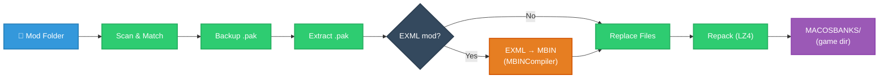
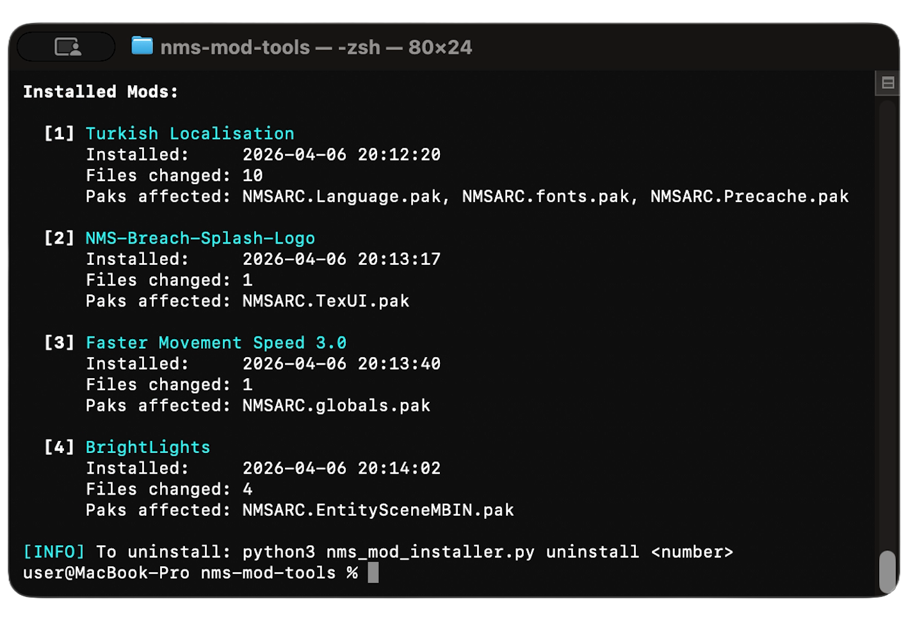
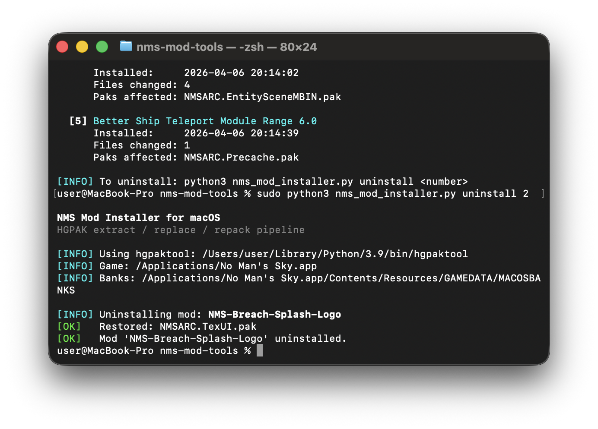

# NMS Mod Installer for macOS

A command-line tool for installing mods into **No Man's Sky** on macOS by patching HGPAK `.pak` archives.

On macOS, the game's built-in `MODS` folder does not work. This tool bridges that gap by extracting `.pak` archives, replacing files with mod contents, and repacking them with LZ4 compression — all automatically.

## How It Works


```mermaid
graph LR
    A["📁 Mod Folder"] --> B["Scan & Match"]
    B --> C["Backup .pak"]
    C --> D["Extract .pak"]
    D --> E{"EXML mod?"}
    E -- Yes --> F["EXML → MBIN\n(MBINCompiler)"]
    E -- No --> G["Replace Files"]
    F --> G
    G --> H["Repack (LZ4)"]
    H --> I["MACOSBANKS/\n(game dir)"]

    classDef input fill:#3498db,stroke:#2980b9,stroke-width:2px,color:#fff
    classDef process fill:#2ecc71,stroke:#27ae60,stroke-width:2px,color:#fff
    classDef convert fill:#e67e22,stroke:#d35400,stroke-width:2px,color:#fff
    classDef output fill:#9b59b6,stroke:#8e44ad,stroke-width:2px,color:#fff
    classDef decision fill:#34495e,stroke:#2c3e50,stroke-width:2px,color:#fff

    class A input
    class B,C,D,G,H process
    class F convert
    class I output
    class E decision
```

1. **Scan** — Indexes all `.pak` archives in the game and maps each mod file to its target `.pak`
2. **Backup** — Copies original `.pak` files to `_MOD_BACKUPS/` before any changes
3. **Extract** — Unpacks affected `.pak` archives using `hgpaktool`
4. **Convert** — If the mod contains `.EXML` patch files, converts them to `.MBIN` via the bundled MBINCompiler
5. **Replace** — Overwrites extracted files with mod versions (case-insensitive matching)
6. **Repack** — Rebuilds `.pak` archives with LZ4 compression
7. **Register** — Records installed mod metadata for clean uninstall later

## Requirements

- **macOS** (tested on macOS 15+)
- **Python 3.9+**
- [hgpaktool](https://github.com/monkeyman192/HGPAKtool) — installed automatically with pip
- **.NET 8 Runtime** — required for EXML-based mods

## Installation

### PyPI (recommended)

```bash
pip install nms-mod-installer-macos
```

### Git clone (developers / contributors)

```bash
git clone https://github.com/Enki013/nms-mod-installer-macos.git
cd nms-mod-installer-macos
pip install hgpaktool
```

## Usage

All commands are available as `nms-mod-installer <command>` after pip install,
or `python3 nms_mod_installer.py <command>` from a git clone.

### Set game path (first time only)

The tool auto-detects the game in common locations (`/Applications`, `~/Applications`, Steam library). If auto-detection fails, set it manually:

```bash
nms-mod-installer set-game "/Applications/No Man's Sky.app"
```

The path is saved to `~/.local/share/nms-mod-installer/` and remembered for future runs.
You can also use `--game <path>` with any command to override.

### Scan a mod (preview, no changes)

```bash
nms-mod-installer scan ~/Downloads/MyMod
```

Shows which `.pak` files the mod will affect without modifying anything.

### Interactive wizard (beginner mode)

```bash
nms-mod-installer wizard
```

Step-by-step guided CLI flow for scan/install/list/uninstall without remembering commands.

### Install a mod

```bash
nms-mod-installer install ~/Downloads/MyMod
```

Full pipeline: scan, backup originals, extract, replace, repack, install.


To preview which paks a mod touches without installing, use `scan` (see above).

### List installed mods

```bash
nms-mod-installer list
```



### Uninstall a mod

```bash
nms-mod-installer uninstall 2
# or by name:
nms-mod-installer uninstall "MyMod"
```

Restores original `.pak` files from backup.



### Options

| Flag | Description |
|---|---|
| `--game <path>` | Path to `No Man's Sky.app` (auto-detected or saved via `set-game`) |
| `--force-reindex` | Rebuild the pak index cache (use after game updates) |

## Mod Folder Structure

Mods must mirror the game's internal directory structure. File and folder names are **case-insensitive**.

```
MyMod/
├── LANGUAGE/
│   └── NMS_LOC1_ENGLISH.MBIN
├── FONTS/
│   └── GAME/
│       └── CONSOLEFONT2.TTF
├── TEXTURES/
│   └── PLANETS/
│       └── ...
└── METADATA/
    └── REALITY/
        └── TABLES/
            └── SOME_TABLE.MBIN
```

The tool automatically determines which `.pak` archive each file belongs to.

## Example: Turkish Language Patch

```bash
# Preview
nms-mod-installer scan ~/Downloads/Turkish\ Localisation

# Output:
# Mod would affect 3 pak(s):
#   NMSARC.Language.pak    (8 files)
#   NMSARC.Precache.pak    (1 file)
#   NMSARC.fonts.pak       (1 file)

# Install
nms-mod-installer install ~/Downloads/Turkish\ Localisation

# Verify
nms-mod-installer list

# Uninstall if needed
nms-mod-installer uninstall 1
```

## Game File Structure (macOS)

On macOS, No Man's Sky stores assets differently from Windows:

| | Windows | macOS |
|---|---|---|
| Archive directory | `GAMEDATA/PCBANKS/` | `GAMEDATA/MACOSBANKS/` |
| MODS folder | Supported | **Not supported** |
| Compression | ZSTD | LZ4 |
| Archive format | HGPAK v2 | HGPAK v2 |

```
No Man's Sky.app/
└── Contents/Resources/GAMEDATA/MACOSBANKS/
    ├── NMSARC.Language.pak      # Localization strings
    ├── NMSARC.fonts.pak         # Game fonts
    ├── NMSARC.Precache.pak      # Metadata, dialog tables, UI
    ├── NMSARC.globals.pak       # Global game settings
    ├── NMSARC.Materials.pak     # Material definitions
    ├── NMSARC.UI.pak            # UI definitions
    ├── NMSARC.TexPlanet*.pak    # Planet textures (per-biome)
    ├── NMSARC.MeshPlanet*.pak   # 3D models
    └── ...
```

## Technical Details

### HGPAK Format

- **Magic:** `HGPAK\x00\x00\x00` (8 bytes)
- **Version:** 2 (uint64 LE)
- **Compression:** LZ4 (macOS), ZSTD (Windows/Linux), Oodle (Switch)
- Introduced in NMS 5.50 (Worlds Part II), replacing the older PSARC format

### Tool Chain

```bash
hgpaktool -L <pak>                          # List contents (outputs filenames.json)
hgpaktool -U -M <pak> -O <dir>             # Extract + generate manifest
hgpaktool -R -Z <manifest> -O <output.pak>  # Repack with compression
```

### Caching

On first run, the tool scans all `.pak` files and builds an index cache (`_pak_index_cache.json`). This cache is valid for 24 hours. After a game update, use `--force-reindex` to rebuild it.

## Troubleshooting

### `pip install` fails / Command Not Found

macOS includes a protection mechanism (PEP 668) that prevents pip from installing packages system-wide. If `pip install nms-mod-installer-macos` fails, or if you get a `zsh: command not found: nms-mod-installer` error, you have two options:

**Option 1: Use `pipx` (Recommended)**

```bash
# 1. Install pipx via Homebrew
brew install pipx
pipx ensurepath

# 2. Restart your terminal (close and reopen)

# 3. Install the app globally in a safe environment
pipx install nms-mod-installer-macos
```

**Option 2: Bypass system protection (Alternative)**

If you prefer using standard pip, you can bypass the restriction by installing it for your user only:

```bash
pip3 install --break-system-packages --user nms-mod-installer-macos
```

### Permission denied (do not use `sudo`)

The installer must write inside `No Man's Sky.app/.../MACOSBANKS/`. If you see **Permission denied**, do **not** run it with `sudo` (that runs the script as root and can confuse file ownership).

**Preferred:** install or copy the game under your user, e.g. `~/Applications/No Man's Sky.app`, so you already own the files.

**If the game is in `/Applications` and owned by root**, fix ownership once:

```bash
sudo chown -R "$(whoami)" "/Applications/No Man's Sky.app"
```

### hgpaktool not found

```bash
pip install hgpaktool

# If not on PATH after pip install:
export PATH="$PATH:$HOME/Library/Python/3.9/bin"
```

### MBINCompiler not found (EXML mods)

If you see `MBINCompiler not found`, it means the native MBINCompiler binary bundled with this package is missing or corrupted. Simply reinstall the package:

```bash
pip install --force-reinstall nms-mod-installer-macos
```

### `.NET` is installed but `dotnet` is not found

If you've already installed the .NET SDK but the installer still reports that `dotnet` is missing, try the following:

1. Close and reopen Terminal.
2. Verify that .NET is available:

   ```bash
   dotnet --info
   ```

3. If the command is still not found, ensure the .NET installation directory is in your `PATH`.

On macOS (Apple Silicon), add this to your shell profile if necessary:

```bash
export PATH="$PATH:/usr/local/share/dotnet"
```

or, if using Homebrew:

```bash
export PATH="$PATH:/opt/homebrew/share/dotnet"
```

After updating your `PATH`, restart your terminal and run:

```bash
dotnet --info
```

### Mod stopped working after game update

Game updates overwrite `.pak` files. Reinstall the mod:

```bash
nms-mod-installer install ~/Downloads/MyMod --force-reindex
```

### Game won't launch / crashes

Remove mods and restore originals:

```bash
nms-mod-installer uninstall "MyMod"
```

Or manually:

```bash
cd "No Man's Sky.app/Contents/Resources/GAMEDATA/MACOSBANKS"
cp _MOD_BACKUPS/MyMod/*.pak ./
```

### macOS "damaged app" warning

Modifying `.pak` files may break the app's code signature:

```bash
xattr -cr ~/Applications/No\ Man\'s\ Sky.app
codesign --force --deep --sign - ~/Applications/No\ Man\'s\ Sky.app
```


## 🛠 MBINCompiler & Troubleshooting

This package bundles a native macOS build of **MBINCompiler**, which handles the conversion of `.EXML` mod patch files to `.MBIN`. Please keep the following in mind:

- **Game Updates**: Every major No Man's Sky update typically breaks several `.MBIN` formats. Because MBINCompiler is tied to specific game versions, `.EXML` mods might fail to install shortly after a game update until the mod author updates their mod and we bundle the newest MBINCompiler release.
- **Conversion Errors**: If you encounter an error like `[ERR] MBINCompiler failed` or `Skipping ... (conversion failed)`, it usually means:
  1. The `.EXML` mod has syntax errors or is made for an older version of the game.
  2. You haven't installed the **.NET 8 Runtime** required to run the bundled MBINCompiler.
  3. The current version of MBINCompiler hasn't been updated for the latest game patch yet.

To verify if an `.EXML` mod is broken, you can try running `MBINCompiler` manually on the vanilla `.MBIN` file. If vanilla files unpack correctly but the mod fails to patch, the mod is likely outdated.

## License

MIT License. See [LICENSE](LICENSE) for details.

## Credits

- **[hgpaktool](https://github.com/monkeyman192/HGPAKtool)** by monkeyman192 — HGPAK extraction and repacking
- **[Hello Games](https://hellogames.org/)** — No Man's Sky
